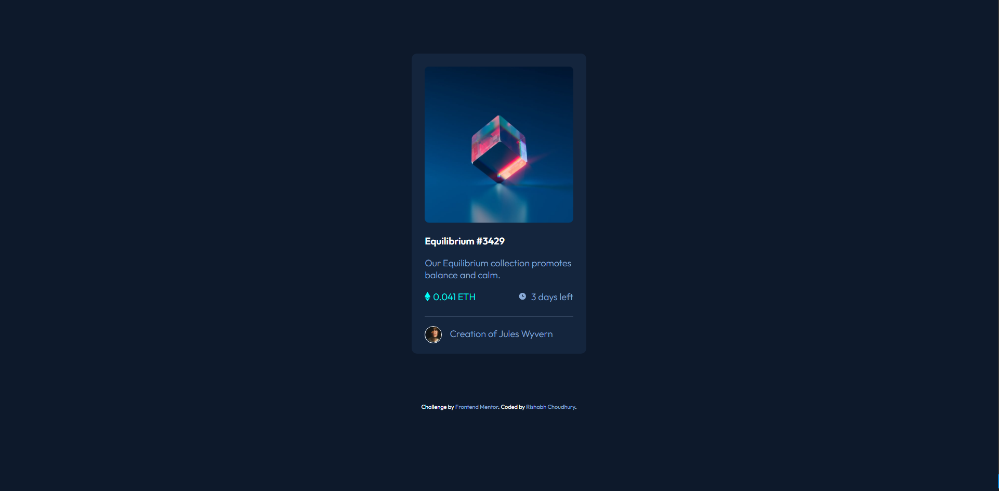

# Frontend Mentor - NFT preview card component solution

This is a solution to the [NFT preview card component challenge on Frontend Mentor](https://www.frontendmentor.io/challenges/nft-preview-card-component-SbdUL_w0U). Frontend Mentor challenges help you improve your coding skills by building realistic projects. 

## Table of contents

- [Overview](#overview)
  - [The challenge](#the-challenge)
  - [Screenshot](#screenshot)
  - [Links](#links)
  - [My process](#my-process)
  - [Built with](#built-with)
  - [What I learned](#what-i-learned)
  - [Continued development](#continued-development)
  - [Useful resources](#useful-resources)
  - [Author](#author)
  - [Acknowledgments](#acknowledgments)

## Overview

This project is a practice in HTML and CSS to further strengthen my knowledge of front end web development. 

### The challenge

Users should be able to:

- View the optimal layout depending on their device's screen size
- See hover states for interactive elements

### Screenshot

### Links

- Solution URL: https://github.com/rishabh2011/NFT-Preview-Card---HTML-CSS-Project
- Live Site URL: https://rishabh2011.github.io/NFT-Preview-Card---HTML-CSS-Project/

## My process

- I started by dividing the content with proper html elements to match that of the design.
- I then set the layout of the html elements as seen in the design. This included separating the existing content into divs for further modification using css. 
- My third step was to setup the fonts used in the design using google fonts. 
- I then moved on to the css styling part. I started by applying the fonts, color, text size, adding images etc.
- I reworked the styling after adding images to match that of the design.
- Finally, I added the various content highlighting parts of the design.

### Built with

- HTML5 markup
- CSS custom properties

### What I learned

- One of the major things I learnt with this project was how css code order works. I wasn't really aware of code priority apart from the fact that inline > internal > external css. I didn't really know that css also had code priority within an external file and that this priority can ultimately affect the style of the website.

- I learnt about the !important rule in css to give maximum priority to a css property even though I didn't end up using it.

- I ultimately realized that inline display property is not really that useful in css and creates more problems than it solves. Hence it should be avoided as much as possible.

- I learnt how to highlight an image in html with a color overlay. This is done by adding a "hover" div on top of it, giving it a color and then modifying its transparency to show the image underneath in a couple of ways:

  One way is to simply set its opacity as 0 by default and then change it to a different transparency value when the user hovers over the div.

  Another way is to set the transparency value of the "hover" div in its background-color property. This way we don't have to modify it's opacity other than setting it to 0 and 1. This is useful when we want to display an additional image on top of the "hover" div such as the view_icon as seen in the design, which has been setup as the "hover" div's child in the hierarchy, without affecting it's transparency.
 
### Continued development

I tried to use the vertical-align css property in various parts of the code but ultimately couldn't use it effectively. I am still hazy as to how the vertical-align property works and how to use it affectively. Will have to focus on it more.

As it turns out, there are a variety of ways to achieve the design one is looking for using css. As such I feel like maybe my code could have been more clean and affective? Maybe there is no guideline as to how to approach a design. If it works it works?
Experience will tell.

I have yet to learn about responsive CSS. This site currently works properly only on 1080p displays. Will update this once I learn responsive css.

### Useful resources

- [MDN Web docs](https://developer.mozilla.org/en-US/) - The OG resource for web development reference. Enough said.
- [Stack Overflow](https://stackoverflow.com/) - Amazing community of programmers helping out others in need. I cleared a lot of hazy css concepts just by looking at solutions provided to questions I had about css that other people had already asked.

## Author

- Website - [Rishabh Choudhury](https://rishabh2011.github.io/CV/)
- Frontend Mentor - [@rishabh2011](https://www.frontendmentor.io/profile/rishabh2011)
- Facebook - [rishabh.choudhury.3152](https://www.facebook.com/rishabh.choudhary.3152)
